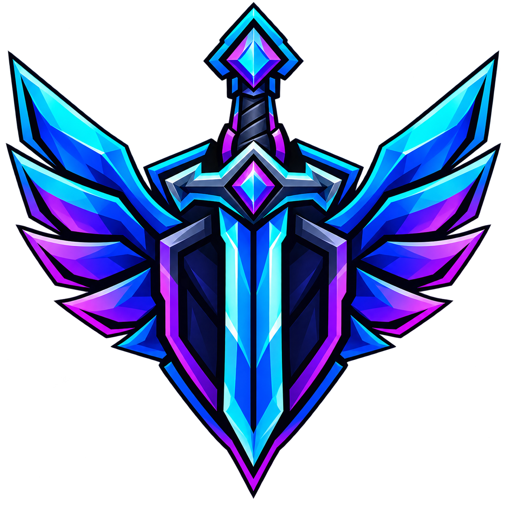

<p align="center"></p>
<h1 align="center">DomiFly Minecraft Launcher</h1>
<p align="center"><em>El launcher oficial y personalizado para la serie DomiFly</em></p>

#### Características Principales
* 🔒 **Autenticación Simplificada:** Sistema de inicio de sesión No Premium integrado. Entra directamente con tu usuario de Ely.by sin depender de cuentas de Microsoft.
* 🎨 **Skins Visibles para Todos:** Soporte nativo de `authlib-injector` en el cliente. El launcher se encarga de renderizar tu cuerpo 3D y cosméticos automáticamente.
* 🚀 **Conexión Directa:** Entra al Servidor DomiFly Minecraft con un solo clic, con la IP y el puerto preconfigurados de fábrica.
* 📂 **Gestión de Mods Automática:** Recibe las actualizaciones de los mods al instante. El launcher valida, descarga y repara cualquier archivo corrupto antes de iniciar el juego.
* ☕ **Validación Automática de Java:** No necesitas preocuparte por la versión de Java; si te falta la correcta, el launcher la descarga y configura por ti de forma invisible.
* ⚙️ Panel de ajustes intuitivo para controlar la memoria RAM asignada al juego.

#### Descargas
Para jugar en la serie, descarga el instalador más reciente para tu sistema operativo desde nuestro canal de Discord oficial.
*(Nota: Añade aquí tu enlace de Discord o MediaFire)*

#### Consola (Para solución de errores)
Si experimentas algún fallo visual o de conexión, puedes abrir la consola de desarrollo del launcher usando el siguiente atajo de teclado:
```console
ctrl + shift + i